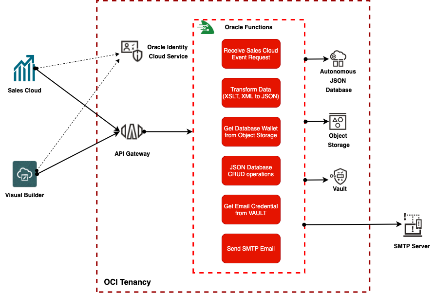
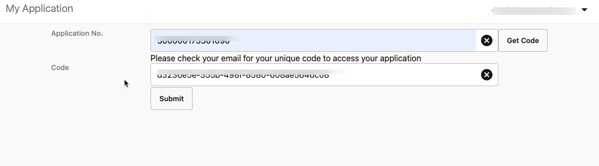
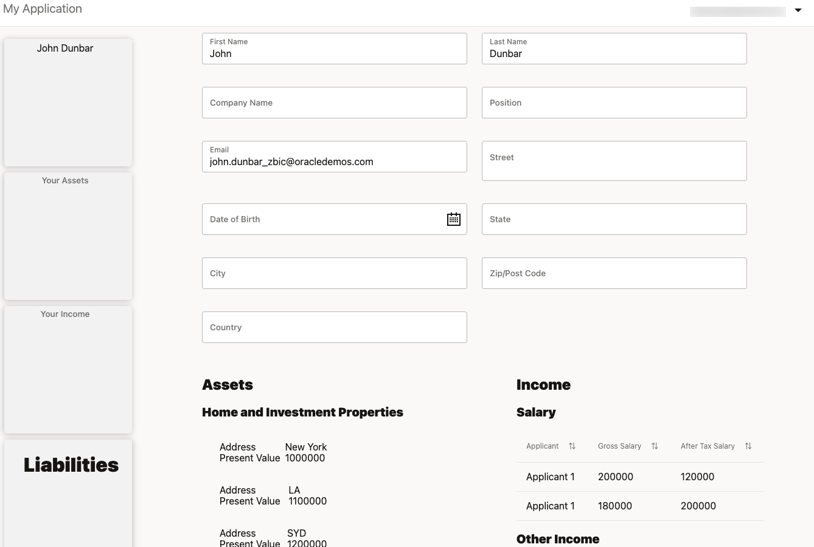

# Cloud native SaaS example: Customer 360 view using Oracle Cloud Functions, Oracle Sales, and Oracle Autonomous JSON Database

## Introduction

This solution shows you how you can use Oracle Cloud Functions to process Oracle CX Sales custom and standard object data, transform the XML data to JSON, merge and store data in Oracle Autonomous JSON Database as JSON documents, and display those JSON documents in an Oracle Visual Builder application by calling Oracle Cloud Functions using Oracle Cloud Infrastructure (OCI) API Gateway.

This architecture has several advantages over traditional solutions:

- When not being used, no services are running and therefore are at zero cost to you
- Oracle-managed servers do not require you to perform upgrades or patches
- All password secrets are stored safely within secure OCI Vault
- Configuration files are stored safely in Object Storage
- The serverless framework automatically scales up and down as neeeded

The core component of this solution comprises only one serverless Oracle Cloud Function.  This function will perform the following tasks:

- Validate the data
- Transform the data using XSLT
- Convert the XML data to JSON
- Combine/Merge the data
- Create/Update/Delete data in Oracle Autonomous JSON Database
- Send email using SMTP server

## Features / patterns demonstrated in this sample

- Serverless solution
- Storing Oracle passwords securely within the OCI vault and retrieving them using Java code
- Reading data from OCI Storage buckets
- Sending an email to a user using an external SMTP server
- Transforming XML data to JSON using XSLT transformation
- Performing Oracle Autonomous JSON Database CRUD operations using Simple Oracle Document Access (SODA)
- Merging multiple Oracle Sales objects data into a JSON document and display it on a Web page

## Services used in this sample

- This demo requires the following Oracle services:
  - [Oracle Sales](https://www.oracle.com/cx/sales/)
  - [Oracle Visual Builder](https://www.oracle.com/application-development/visual-builder/)
  - [Oracle Cloud Functions](https://www.oracle.com/cloud-native/functions/)
  - [Oracle Autonomous JSON Database](https://www.oracle.com/autonomous-database/autonomous-json-database/)
  - [Oracle Cloud Infrastructure Vault](https://www.oracle.com/security/cloud-security/key-management/)
  - [Oracle Cloud Infrastructure Object Storage](https://www.oracle.com/cloud/storage/object-storage.html)
  - [Oracle Cloud Infrastructure API Gateway](https://www.oracle.com/cloud-native/api-gateway/)
  - [Oracle Identity Cloud Service](https://www.oracle.com/security/cloud-security/identity-cloud/)

## Solution Architecture

When an Oracle Sales user creates or updates an opportunity and custom object data in Oracle Sales, an object workflow event will be fired. This event is configured to call a serverless cloud function using the OCI API Gateway. The serverless function transforms the XML data to JSON format, retrieves, merges, and then stores the data in an Oracle Autonomous JSON database. The serverless function is secured using OCI API Gateway and Oracle Identity Cloud Service with OAuth. In order to make it more secure and flexible, the configuration files used in this sample solution are stored in OCI Object Storage and all user credentials are stored in the secured OCI Vault.

An authorized Sales Cloud user can retrieve their own data in the Oracle Autonomous JSON database using the web application developed using Oracle Visual Builder. The serverless cloud function will generate a unique code and send it to the user over an external SMTP server. With the unique code, the user can retrieve and display the data in the Oracle Visual Builder application.

## Installation

See [installation guide](docs/INSTALLATION.md) for details.

## Running the sample

In order to run the sample, you need to make sure all components in the installation guide are deployed and configured.

- Log in to the Oracle Visual Builder application.
- Enter the Application No. (in this case it will be the Opportunity No.) and click the Get Code button.
- You will receive a unique code in your email:
    
- Enter the unique code and click the Submit button to retreive the loan data for this application/opportunity:
    

## Contributing

See the [contribution guide](CONTRIBUTING.md) for details.

## Security

See the [reporting security vulnerabilities procedure](SECURITY.md) for details.

## Get Help

Visit Oracle Cloud Customer Connect Community at [Cloud Customer Connect](https://cloudcustomerconnect.oracle.com) for additional resources and FAQs.

## License

Licensed under the [Universal Permissive License v 1.0](https://oss.oracle.com/licenses/upl)

See [LICENSE](LICENSE.txt) for details.

## Copyright

Copyright (c) 2021 Oracle and/or its affiliates.
