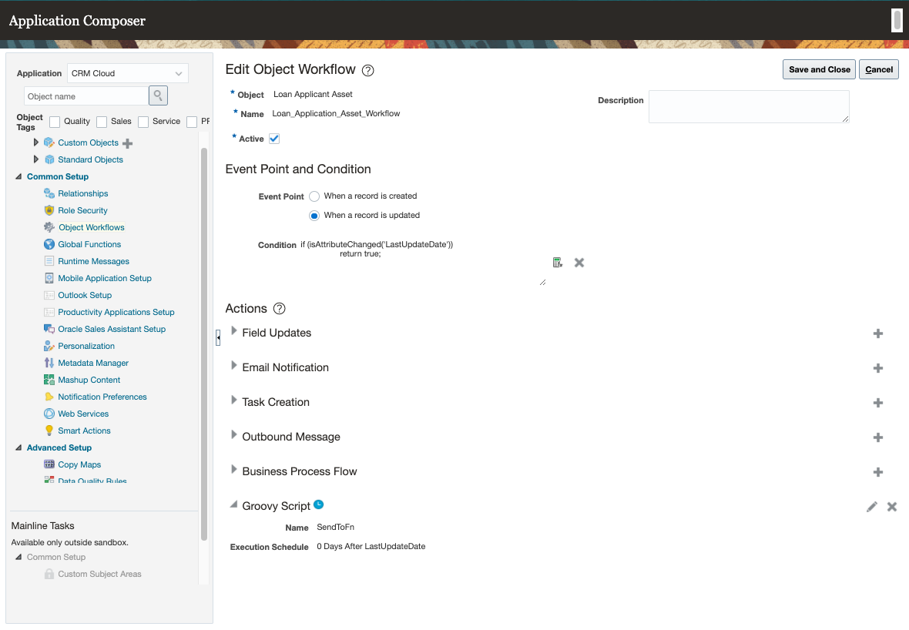
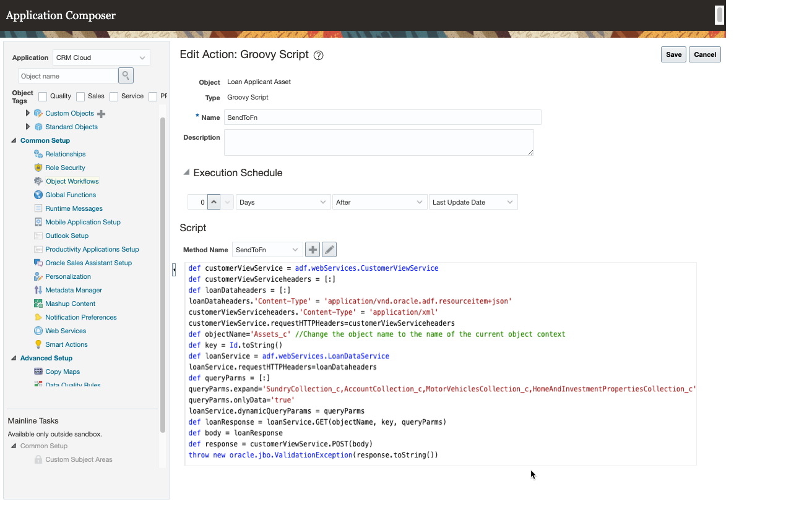

# Installation

## Pre-requisites

- Ensure Oracle Cloud Functions is installed and that you can deploy a simple Java-based Oracle Cloud Function. If you haven't already installed and configured Oracle Cloud Functions then we can recommend going through the [Oracle Cloud Functions quickstart tutorial](https://www.oracle.com/webfolder/technetwork/tutorials/infographics/oci_faas_gettingstarted_quickview/functions_quickview_top/functions_quickview/index.html) as this will not only help you setup and configure your environment but also show you how to deploy some sample Oracle Cloud Functions to OCI.
- Ensure you have access to Oracle Vault and Oracle Object Storage in your Oracle Cloud Infrastructure (OCI) compartment
- Ensure you have access to Oracle Sales Cloud and have all necessary permissions to access the application composer tool.

## Oracle Autonomous JSON Database setup and configuration

If you haven't already provisioned and configured an Oracle Autonomous JSON Database, you can follow the steps in the [Provision Autonomous JSON Database guide](https://docs.oracle.com/en/cloud/paas/autonomous-json-database/ajdug/autonomous-provision.html#GUID-0B230036-0A05-4CA3-AF9D-97A255AE0C08) to provision a JSON database.

Once the database is provisioned, you need to download the Oracle client credentials (wallet files) from the Autonomous Database details page.  You can follow the instruction in [Download Client Credentials (Wallets)](https://docs.oracle.com/en/cloud/paas/autonomous-database/adbsa/connect-download-wallet.html#GUID-B06202D2-0597-41AA-9481-3B174F75D4B1).

## Oracle Cloud Functions, OCI Object Storage, and OCI Vault configuration

Before you can deploy a serverless function, you need to make sure the Oracle Functions is configured and verified for deployment, you can follow the instructions in [Oracle Functions Quick Start Guides](https://www.oracle.com/webfolder/technetwork/tutorials/infographics/oci_faas_gettingstarted_quickview/functions_quickview_top/functions_quickview/index.html) to prepare your environment for deployment.

To deploy the serverless function for this sample solution:

1. Clone the sample code from this repository.

2. This sample will use SOADA for Java to connect the Oracle Autonomous JSON Database.  You need to create a `lib` folder in the `<repo>/customerview-fn` folder, e,g, `<repo>/customerview-fn/lib` and download `orajsoda-1.1.7.jar` from this [link](https://github.com/oracle/soda-for-java/releases) and save it to the `lib` folder.

3. Run the following command to create the Oracle Cloud Functions application in OCI, ensure you pass a valid existing subnet from your networking configuration. This would have been created as part of the Oracle Cloud Functions quickstart tutorial but you are free to use any public subnet within your OCI infrastructure.

      ```bash
          fn create app customerview --annotation oracle.com/oci/subnetIds='["<subnet-ocid>"]'
      ```

4. Login to the OCI console and create an Object Storage folder with the bucket name "JSONDBWallet".

5. Unzip the downloaded Oracle client credentials (wallet files) zip file for the Oracle Autonomous JSON Database to a temp folder, then upload all files to the object storage bucket (JSONDBWallet)

6. Create a OCI Vault in your tenancy, this is used to store the DB Secret and your SMTP server password. Once the vault is created note down the OCID for both secrets (DB Secret and SMTP server password) as you you need it in step #9.  If needed please see the [OCI Vault documentation](https://docs.oracle.com/en-us/iaas/Content/KeyManagement/Concepts/keyoverview.htm) on how to create an OCI Vault and its related secrets.

7. Run the following commands to create configuration parameters within the Oracle Cloud Functions application. replace the appropriate values with your system specific values, e.g. the DB Password secret OCID which was created earlier. These values can also be added using the OCI console.

    ```bash
    fn config app customerview DB_URL jdbc:oracle:thin:\@customerviewdb_high\?TNS_ADMIN=/tmp/wallet
    fn config app customerview DB_USER Admin
    fn config app customerview NAMESPACE <namespace>
    fn config app customerview BUCKET_NAME <JSONDBWallet>
    fn config app customerview EMAIL_SECRET_OCID <email vault ocid>
    fn config app customerview DB_SECRET_OCID <db vault ocid>
    fn config app customerview SMTP_SERVER <smtp.server.com>
    fn config app customerview SMTP_USER <smtp userid>
    fn config app customerview SMTP_SERVER_PORT <smtp port>
    fn config app customerview OCI_REGION <oci region for object storage and vault>
    fn config app customerview WALLET_DIR /tmp
    ```

8. Go to the repository `<repo>/customerview-fn` folder and run the following command to deploy the serverless function. This command deploys the customerview Java based Oracle Cloud Function to OCI.

  ```bash
      fn -v deploy --app customerview
  ```

## OCI API Gateway setup and configuration

You need to create and configure the API Gateway to process and route the traffic from the Oracle Sales and the VB application to the serverless function.  Follow the instructions describe in [Creating an API Gateway](https://docs.oracle.com/en-us/iaas/Content/APIGateway/Tasks/apigatewaycreatinggateway.htm) and the data points below to create the API gateway and add routes to the serverless function deployed in the previous step.

**API Gateway Configuration:**  
Name: `Customer360-Gateway`  
Type: `Public`  
Compartment:  `select your compartment`  
VCN: `select your VCN`  
Subnet: `select the public subnet in your VCN`  

**Deployment:**  
Name: `Customer360`  
Path Prefix:  `/customer360`  

**Route 1:**  
Path : `/loan`  
Methods: `GET, Post`  
Type: `Oracle Functions`  
`Select the function deployed for this sample: e.g. customerview`  
Function name: `customerview-fn`  

**Route 2:**  
Path : /verify  
Methods: GET  
Type: Oracle Functions  
`Select the function deployed for this sample: e.g. customerview`  
Function name: `customerview-fn`  

We also need to make sure the REST calls between Oracle Sales/VB application and the serverless function are secured. You can refer to this [blog article](https://www.ateam-oracle.com/bicc-securing-extract-logs-rest-services) to configure using OAuth to secure the serverless function with API Gateway and Oracle Identitity Cloud Service (IDCS). This blog article describes how to secure a BICC webservice, in this sample we'll be securing out a serverless function. So, you can follow the **Configuration of an API Gateway Deployment** and **Setup a Custom App in IDCS** section of this article. However, instead of configuring the API Gateway pointing to the BICC NodeJS webservice, we'll point it to our serverless function.

## Import and configure the Oracle Visual Builder

This sample solution contains an Oracle Visual Builder(VB) application that displays the data retrieved from the database.  You need to deploy the VB application and configure the service connection endpoints created for this sample solution.

1. Go to the '`<repo>/VB/src` folder, you will notice there 1 VB src folder: customerview-1.0, zip this folder to create a deployment zip file, e.g. customerview-1.0.zip
2. Sign in to the VB instance.
3. Import the VBS application using the zip file.
4. Open the VB application, for each service, go to services->servers, edit the server to configure the authentication if required, test and save the sample response data.

## Oracle Sales configuration

This sample solution require number of custom objects with child object. Use the information in this section to create the custom objects, web services, and object workflows in the Application Composer. If you are not familiar with using Application Composer in Oracle Sales, you can refer to [Configuring Applications Using Application Composer](https://docs.oracle.com/en/cloud/saas/applications-common/21a/oacex/index.html) on how to add objects and fields, create object workflows and using groovy scripting etc.

### Custom objects

Login to the Oracle Sales Cloud, create a sandbox with Application Composer support and then configure the following custom objects and child objects:

#### Name: Assets

API_Name: Assets_c  
Fields:  

| Name   | Field Type | Default Value |
|--------|------------|---------------|
| Type   | Text       | Assets        |
| OptyId | Text       |               |

  **Child Objects:**  
  Name: Account  
  API Name: Account_c  
  Fields:  

| Name                     | Field Type |
|--------------------------|------------|
| Balance                  | Currency   |
| FinancialInstitutionName | Text       |

  Name: HomeAndInvestmentProperties  
  API Name: HomeAndInvestmentProperties_c  
  Fields:  

| Name         | Field Type |
|--------------|------------|
| PresentValue | Currency   |
| Address      | Text       |

  Name: MotorVehicles  
  API Name: MotorVehicles_c  
  Fields:  

| Name              | Field Type |
|-------------------|------------|
| PresentValue      | Currency   |
| Make              | Text       |
| Model             | Text       |
| YearOfManufacture | Text       |

Name: OtherAssets  
API Name: OtherAssets_c  
Fields:  

| Name         | Field Type |
|--------------|------------|
| PresentValue | Currency   |
| Description  | Text       |

#### Name: LoanApplicantIncome

API_Name : LoanApplicantIncome_c  

| Name   | Field Type | Default Value |
|--------|------------|---------------|
| Type   | Text       | Income        |
| OptyId | Text       |               |

**Child Objects:**  
Name: OtherIncome  
API Name: OtherIncome_c  
Fields:  

| Name              | Field Type |
|-------------------|------------|
| AfterTaxAmount    | Currency   |
| GrossAmount       | Currency   |
| OtherIncomeType   | Text       |

Name: Salary  
API Name: Salary_c  
Fields:  

| Name              | Field Type |
|-------------------|------------|
| AfterTaxSalary    | Currency   |
| GrossSalary       | Currency   |
| Applicant         | Text       |

#### Name: LoanApplicantLiabilities  

API_Name : LoanApplicantLiabilities_c  
Fields:  

| Name   | Field Type | Default Value |
|--------|------------|---------------|
| Type   | Text       | Liabilities   |
| OptyId | Text       |               |

**Child Objects:**  
Name: CreditAndStoreCard  
API Name: CreditAndStoreCard_c  
Fields:  

| Name                     | Field Type |
|--------------------------|------------|
| AmountOwing              | Currency   |
| CreditLimit              | Currency   |
| Borrower                 | Text       |
| CardType                 | Text       |
| FinancialInstitutionName | Text       |

Name: HomeAndInvestmentPropertyLoa  
API Name: HomeAndInvestmentPropertyLoa_c  
Fields:  

| Name                     | Field Type |
|--------------------------|------------|
| AmountOwing              | Currency   |
| OriginalLoanAmount       | Currency   |
| Borrower                 | Text       |
| PropertyType             | Text       |
| FinancialInstitutionName | Text       |

Name: OtherLoan  
API Name: OtherLoan_c  
Fields:  

| Name                             | Field Type |
|----------------------------------|------------|
| AmountOwing                      | Currency   |
| CurrentLimitOrOriginalLoanAmount | Currency   |
| Borrower                         | Text       |
| Purpose                          | Text       |
| FinancialInstitutionName         | Text       |

Name: PersonalLoan  
API Name: PersonalLoan_c  
Fields:  

| Name                             | Field Type |
|----------------------------------|------------|
| AmountOwing                      | Currency   |
| CurrentLimitOrOriginalLoanAmount | Currency   |
| Borrower                         | Text       |
| Purpose                          | Text       |
| FinancialInstitutionName         | Text       |

### Web services

When the event is triggered in Oracle Sales, the workflow will invoke the REST services you deployed in Oracle Functions.  So before you can configure the Object Workflow in Oracle Sales, you need to create the following web services in Application Composer:

- Retrieve the object data using the Id:
  - Name: `LoanDataService`
  - URL:  `https://<ocs_host>:443/crmRestApi/resources/latest/##object##/##key##`
  - Authentication Scheme: `Call using IDCS OAUTH`
    - Client Credential Key: Give the key a name
    - Token URI:  `https://<idcshostname>/oauth2/v1/token`
    - Scope : `This will be the same as the resource that was added to the IDCS client application when you configure the IDCS for the API Gateway`
    - Subject Precedence : `Unchecked`
    - Credential Key for Switch Identity: `Enter/Create the Credential Key  (Please note that the user defined in the key must also exist in both IDCS and Oracle Sales. The user's password in the Credential Key is the Oracle Sales user password, not the IDCS password)`
  - Method: `GET`
  - Format: `JSON`
  - Request Payload Code Sample: `{}`
  - Response Payload Code Sample: `{}`
- Post data to Fn via API Gateway
  - Name: `CustomerViewService`
  - URL :  `https://FN-API-Gateway-URL`
  - Authentication Scheme: `Call using IDCS OAUTH`
    - Client Credential Key: Give the key a name
    - Token URI:  `https://<idcshostname>/oauth2/v1/token`
    - Scope : `This will be the same as the resource that was added to the IDCS client application when you configure the IDCS for the API Gateway`
    - Subject Precedence : `Unchecked`
    - Credential Key for Switch Identity : `Enter/Create the Credential Key  (Please note that the user defined in the key must also exist in both IDCS and Oracle Sales. The user's password in the Credential Key is the Oracle Sales user password, not the IDCS password)`
  - Method: `POST`
  - Format: `XML`
  - Request Payload Code Sample: `<?xml version = '1.0' encoding = 'UTF-8'?><LoanData/>`
  - Response Payload Code Sample: `<?xml version = '1.0' encoding = 'UTF-8'?><LoanData/>`

### Object workflows

Object workflow in Oracle Sales is another key part of this sample solution.  It defines the process of when and how to send the data, and what data you want to send to the serverless function you've deployed for this sample solution.  To create object workflow for the custom objects above and the opportunity object with Groovy script action.



Event point: When a record is updated

- Condition: `if (isAttributeChanged('LastUpdateDate'))  return true;`
- Execution Schedule: `0 Days After LastUpdateDate`  

Event point: When a record is created  

- Condition: `if (isAttributeChanged('CreationDate'))  return true;`
- Execution Schedule: `0 Days After CreationDate`  

The sample groovy scripts can be found in the scripts folder:

- [Opportinities](../scripts/opportunity.groovy)
- [Assets](../scripts/assets.groovy)
- [Income](../scripts/income.groovy)
- [Liabilities](../scripts/liabilities.groovy)



## Reference

[Import a Visual Application](https://docs.oracle.com/en/cloud/paas/app-builder-cloud/visual-builder-developer/import-and-export-applications.html#GUID-845B8CD3-E196-4865-8F19-24F29B472B5D)  
[Engagement Cloud - Outbound REST Using IDCS OAUTH](https://www.ateam-oracle.com/engagement-cloud-outbound-rest-using-idcs-oauth)  
[Object Workflows](https://docs.oracle.com/en/cloud/saas/applications-common/21a/oacex/object-workflows.html#OACEX1512779)  
